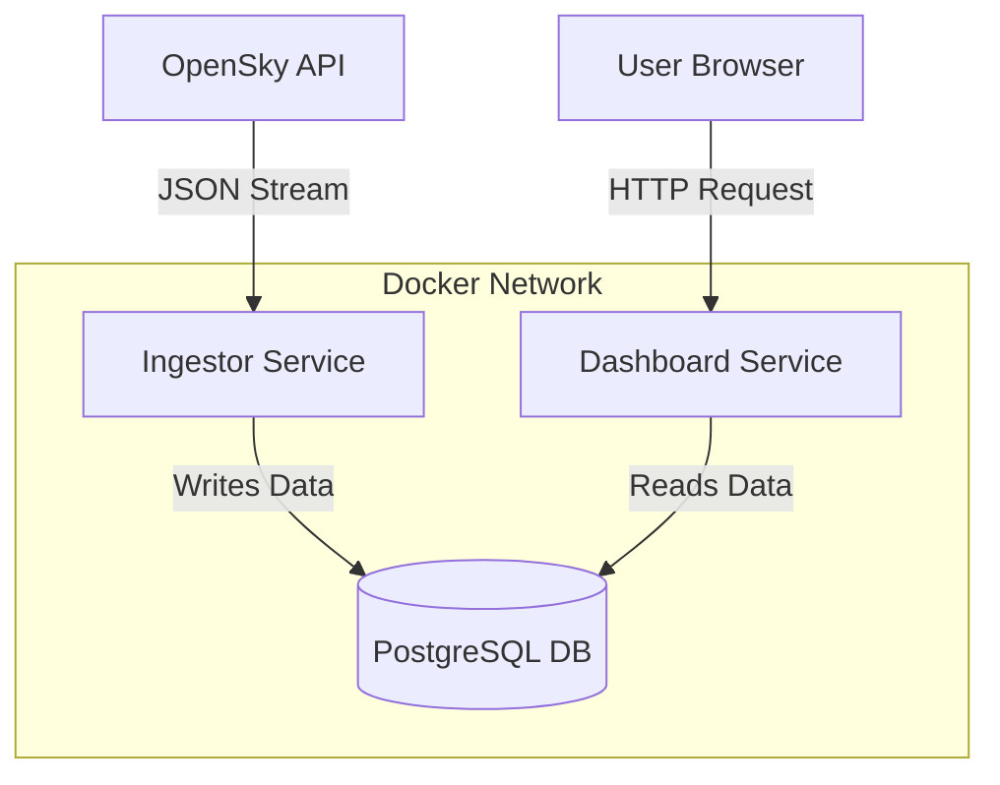

# ✈️ SkyLogger: Live Aviation Telemetry Dashboard

> **Academic Project:** Software Development (DLBSEPPSD01_E)  
> **Institution:** IU International University of Applied Sciences

---

## 📖 Project Overview

**SkyLogger** is a full-stack, containerized application designed to log and visualize real-time aviation data. 

While public flight trackers (like FlightRadar24) show live traffic, they do not allow users to easily store historical telemetry for custom analysis. This project solves that problem by implementing a **Microservices Architecture** that automatically:
1.  **Ingests** live flight data (Position, Altitude, Velocity) from the OpenSky Network API.
2.  **Stores** the data in a persistent relational database (PostgreSQL).
3.  **Visualizes** the traffic on an interactive map and dashboard for historical analysis.

---

## 🏗️ Technical Architecture

The system is composed of three decoupled services orchestrated via **Docker Compose**.

---
🚀 Installation & Usage
Prerequisites
Docker Desktop installed and running.

Git installed.

1. Clone the Repository
Bash

git clone [https://github.com/YOUR_USERNAME/skylogger-project.git](https://github.com/YOUR_USERNAME/skylogger-project.git)
cd skylogger-project
2. Build and Run
Launch the entire system with a single command:

Bash

docker compose up --build
Wait until you see the log message: ✅ Connected to Database.

3. Access the Dashboard
Open your web browser and navigate to:

http://localhost:8501

(If localhost does not work, try: https://www.google.com/search?q=http://127.0.0.1:8501)
---

🧪 Testing
The project includes unit tests to verify core logic (e.g., coordinate validation and unit conversions).

To run the tests, execute the following command:

Bash

python -m unittest ingestor/tests/test_logic.py

📂 Project Structure
Plaintext

skylogger-project/
├── docker-compose.yml       # Orchestration config for all services
├── README.md                # Project documentation
├── ingestor/                # Service A: Backend Data Collector
│   ├── Dockerfile
│   ├── requirements.txt
│   ├── collector.py         # Main logic script
│   └── tests/               # Unit Tests
├── dashboard/               # Service B: Frontend Visualization
│   ├── Dockerfile
│   ├── requirements.txt
│   └── app.py               # Streamlit Dashboard Application

⚖️ License & Credits
Data Source: OpenSky Network API

License: This project is for educational purposes.
